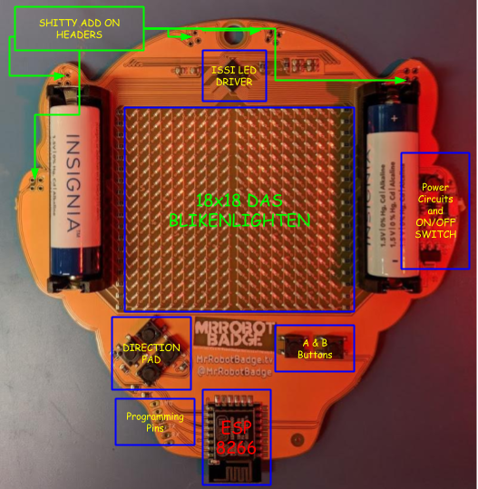
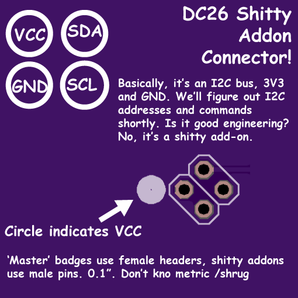
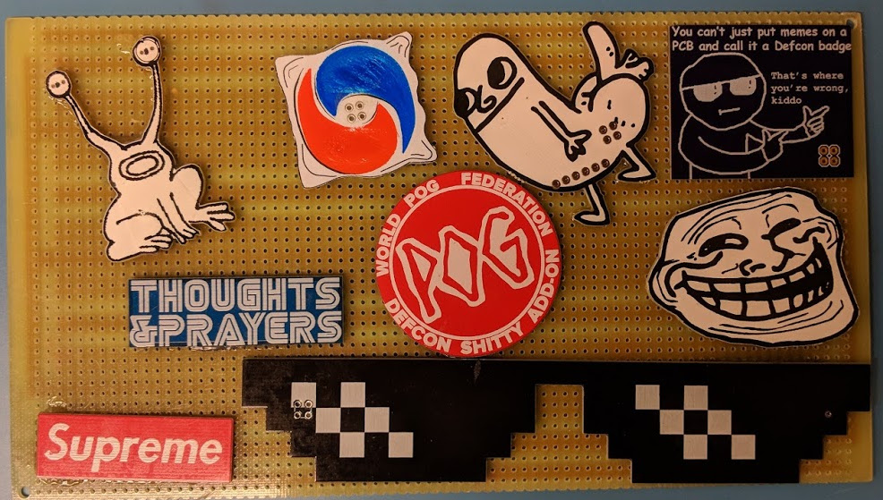
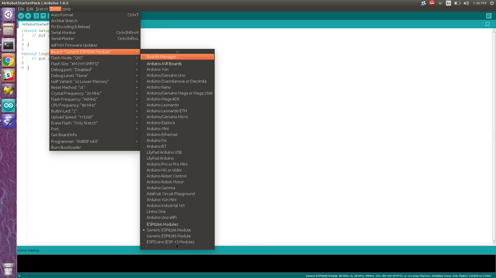
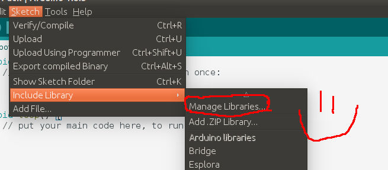
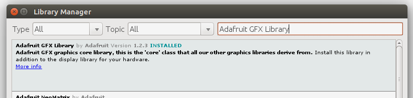
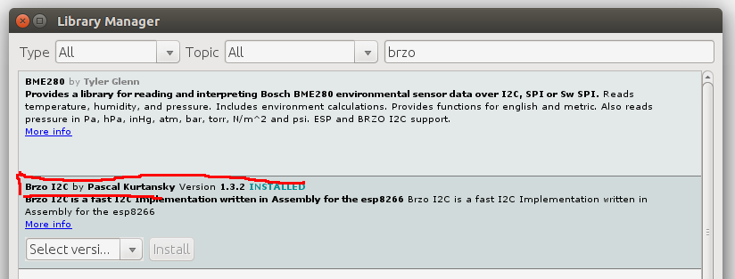
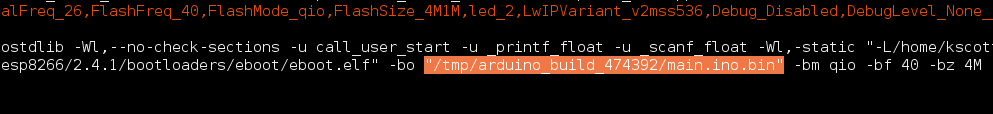
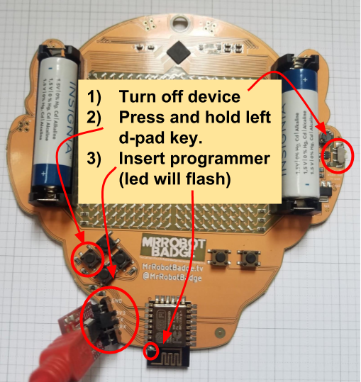

# MrRobotStarterPack

  </img>

Click here to see firmware starter pack in action.

# Where to Get a Badge
* We are only selling badges at the [Hackers on Planet Earth (HOPE) 2018](https://hope.net/) and [DEFCON 26](https://www.defcon.org/).
* Badges are sold via flash sales. Follow us on the [twitter](https://twitter.com/MrRobotBadge) or check the [Mr Robot Homepage](http://www.mrrobotbadge.tv/) for more info.
* If we have any badges left over they will go up on [Tindie](https://www.tindie.com/). Sometimes the badges end up on Ebay for 3-5x their retail price. If you buy two they'll pay for themselves.
* Check out what other people are doing with their badges by searching twitter for [#badgelife](https://twitter.com/search?q=%23badgelife&src=typd) or [#MrRobotBadge](https://twitter.com/hashtag/MrRobotBadge?src=hash)
* *Once the are gone. They are gone!* We're never doing another production run.
* After DefCon 26, after we've slept off our hang-overs we'll post the full hardware and software as open source hardware and software. Stay tuned. You should be able to clone the badge if you really want.

# Description of the Badge

The Mr. Robot Badge consists of:
* An [ESP8266 ESP-12E module](https://media.digikey.com/pdf/Data%20Sheets/Adafruit%20PDFs/ESP-12S_UM%20_Rev1.0_8-1-16.pdf). This bad boy has:
   * A blazin' fast 80Mhz Processor
   * 4MB of Flash Space
   * 802.11b/g/n WiFi
   * Supports SDIO 2.0, (H) SPI, UART, I2C, I2S, IRDA, PWM, GPIO
* An [ISSI 3741](http://www.issi.com/WW/pdf/IS31FL3741.pdf) matrix LED driver chip.
* A set of keys for interactivity.
* Power circuitry to run the badge of two AA batteries.
* An 18x18 red LED matrix. That's 324 friggin LEDs.
* Five! Count em. Five! Shitty add on headers. Supporting the shitty add on standard. These headers are loacted on the I2C bus at address `0x50`. Each shitty add on header on the badge supports the full Shitty Add On specification (as seen below).
* 
* Each Mr. Robot Badge comes with a random Shitty Add On from the collection below.

# Development Environment Setup
## Arduino IDE Setup
* [Install a recent stock arduino IDE.](https://www.arduino.cc/en/Main/Software)
* Now we need to add ESP 8266 drivers to your IDE. To do this go Tools->Boards->BoardManager and a pop up should emerge.
  
  In the pop up search for `ESP8266` and install the board.
  

* Once you have installed te hardware package for the ESP8266 we can now add the software dependencies to the arduino IDE. To do this hit Sketch->Include Library->Manage Libraries and a dialog should pop up.
  
  * The first library we'll add is the Adafruit graphics library. We implement the Adafruit interface for rendering. In the dialog search for `Adafruit GFX` and install the library.
  
  * The second library we need is [Brzo](https://github.com/pasko-zh/brzo_i2c). Brzo is a fast I2C (eye-squared-see) interface written in assembly for ESP8266. It is much better than the built-in one for Arduino. We use it because our frame buffer is 324 bytes and the Arduino I2C library only let's you move 32 bytes at a time. This lets us send images to display as one big chunk. To install it search for `Brzo` in the library dialog.
  
* That should be it. You should now be able to build your own firmware.
## Image Tool Chain Setup
* The image toolchain is still in beta form. It was developed for linux systems and should work on OSX reasonably well. For Windows, reformat your hard drive and install linux.
* The image tool chain is a big hack, cobbled together using bash scripts, python, and the image magick command line utilitiy. What it does is looks through three directories `gifs`, `images`, and `scroll` and converts the images into byte arrays that can displayed on the badge. Once installed all you need to do is drop your images in the directory, run the script, and re-compile your firmware. The script will automagically read your images, process them, and dump them to header files with variables named to match the input image files.
* Assuming you have a system python intalled (preferably 3.x+) install the dependencies via pip. The deps are kinda heavy so good luck.
  ` sudo pip install -r ./python/requirements.txt`
* If OpenCV gives you issue try installing it via apt using the following command. `sudo apt-get install python-opencv`. If you are using python 2.7 try using `python2.7-opencv`.
* The tool chain makes liberal use of [ImageMagick](https://www.imagemagick.org/script/index.php) which is a fantastic tool for image manipulation. To install it use the following command: `sudo apt-get install imagemagick`
* There are three utilities in the python directory:
  * `img2bitmap.py` Takes in a directory of images, scales them and puts the results in a header file nominally called `Bitmaps.h`
  * `img2scroll.py` This program takes in a directory of images, scales them as needed, and puts them in a header file called `scrolls.h`. These static images can scroll on the screen either horizontally or vertically.
  * `gif2code.py` This program takes in a directory of animated gifs and makes animation files from them. Nominally it saves its results to `Animations.h`
  * To make life easy all of these utilities are wrapped up in `create_headers.sh` which will look for files in the correct directories and then write to the standard header files. To create your own images just copy them to the correct directory and run `./create_headers.sh`
* *NOTE* Sometimes the arduino IDE does not pick up file changes outside the IDE. If you experiece weirdness try restarting the arduino IDE.
* Notes on images. Our experience is that hand-crafted grayscale images work best. You really only get 4-5 levels of brightness on the badge, and the array is only 18x18 pixels. For this reason it is usually best to hand-craft your graphics using a utility like [GIMP](https://www.gimp.org/).

## Flashing Firmware
* To flash your firmware you will need and ESP8266 programmer and the [ESPTool source code.](https://github.com/espressif/esptool). The ESPTool source can quickly be installed via pip by running. `python -m pip install esptool` or `pip2 install esptool`.
* Programmers are cheap and easy to come by.[We really like this model,](https://www.amazon.com/Qunqi-FT232RL-Serial-Adapter-Arduino/dp/B014Y1IMNM/ref=sr_1_3?s=electronics&ie=UTF8&qid=1532817837&sr=1-3&keywords=esp8266+programmer&dpID=51APtQLO3hL&preST=_SY300_QL70_&dpSrc=srch) but they are easy to find on the web.
* Our ESP runs on 3.3V. *If your programmer has a voltage selector via switch or a jumper you'll need to set it to 3.3V.*
* To program your badge you'll first need to compile your source code. _The Arduino IDE outputs your resulting binary file to a temporary directory that changes every time you open up the IDE._ To find it look through the debug output after compilation. About six or seven lines above the last line of the debug output should be something that looks roughly like `/tmp/arduino_build_474392/main.ino.bin`. The file name and path will be slightly different, but that is the path to the binary you will use to flash your badge.

* To program your board you must set it to programming mode. This requires four steps:
  * 
  * Turn the board off. To do this turn the power switch on the right side of the badge to its down position.
  * *Press and hold* the left button on the d-pad.
  * While still holding the left button insert the programmer as shown. The blue LED on the ESP should flash. Once it flashes you can let go of the left button on the d-pad. If you are un-sure on which way to plug in the programmer, just keep trying. Inserting the programmer wrong will not hurt the device; it will simply fail to program.
  * Run the programming script as follows:
  `sudo esptool.py write_flash 0x00000 <PATH_TO_BIN_FILE>`

  * For example, using the binary we found above, our command would be:
  `sudo ./esptool.py  write_flash 0x00000 /tmp/arduino_build_474392/main.ino.bin`

  * If the programmer is sucessful you'll get an info message; otherwise you'll see an error.

# Misc

* Pull requests gladly accepted.
* If you experience any issues please file a ticket.
* We'll get to you when we get a minute.
