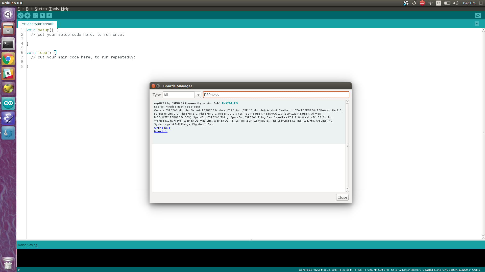

# MrRobotStarterPack
Mr. Robot Badge Firmware Starter Pack.

# Description of the Badge
# Arduino IDE Setup Instructions
* [Install a recent stock arduino IDE.](https://www.arduino.cc/en/Main/Software)
* Now we need to add ESP 8266 drivers to your IDE. To do this go Tools->Boards->BoardManager and in the pop up search for `ESP8266`.
![Board](./img/boards.png0

* Once your IDE is installed we need to install a few packages manually using the IDE. You will need the following:
  * Adafruit graphics library. We implement this interface for rendering.
# Image Tool Chain Setup
# Badge Flashing Instructions
  * Where to get a programmer.
  * How to program a badge.